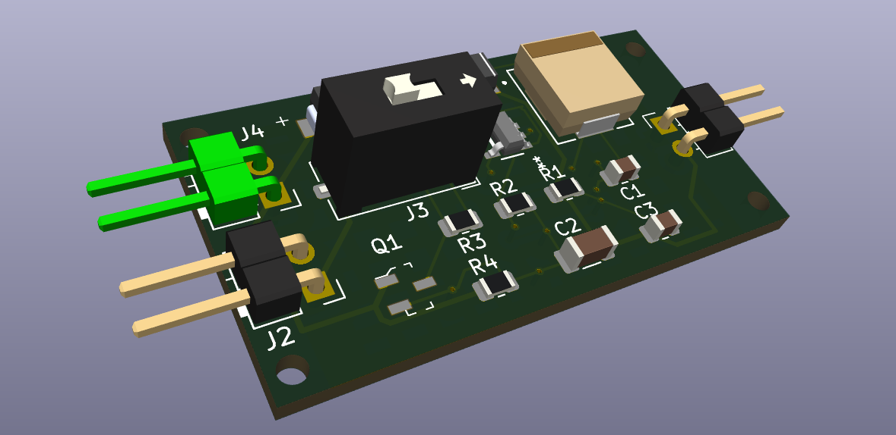
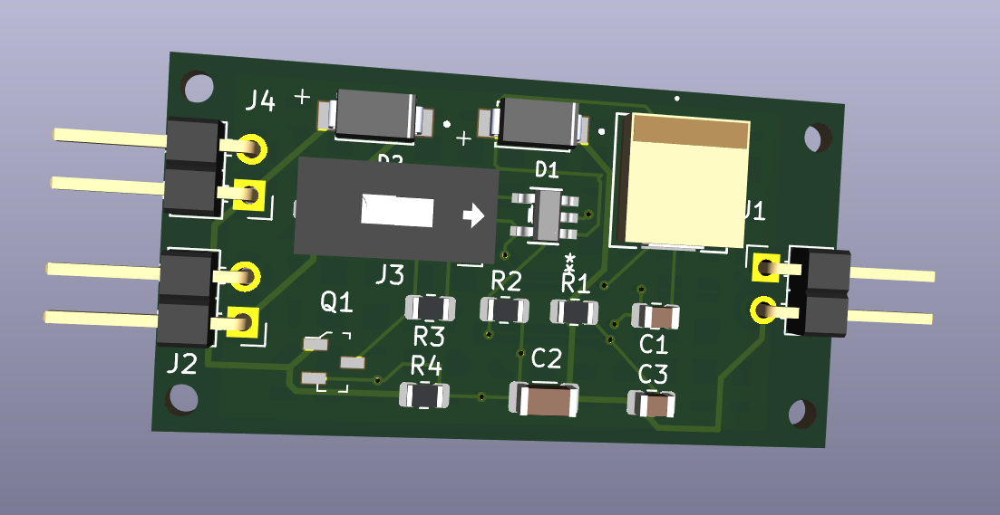

# Tiny Solar Supply – Regulated 3.3V Solar Boost Converter (Custom PCB)

This project is a custom PCB implementation of the **Tiny Solar Supply** boost converter originally designed by **Clemens Valens (Elektor)**. The circuit takes a **1.2 V Ni-MH AA battery**, charged by a small solar panel, and boosts it to a stable **3.3 V output** suitable for microcontrollers and other low-power electronics.

My contribution in this repository is the **full PCB design**, recreated based on the schematic published by Elektor.
Original article:
**Elektor Magazine – “Tiny Solar Supply: Sunlight In, 3.3 V Out”**
[https://www.elektormagazine.com/magazine/elektor-305/62009](https://www.elektormagazine.com/magazine/elektor-305/62009)
*All credit for the original circuit concept and schematic goes to Elektor and the author, Clemens Valens.*

---

## 📸 PCB 3D Renders

### Front-Side 3D View



### Top-Down 3D View



---

## 🔧 Overview

This PCB implements a **step-up DC/DC converter** using the AP3015/AP3015A.
The goal is to repurpose small garden-light solar panels and their rechargeable batteries into a reliable 3.3 V supply with **automatic day/night switching**.

### Key Features

* Boosts **1.0–1.2 V** battery voltage to a regulated **3.3 V** output
* **Solar charging path** using SS14 diodes
* Automatic shutdown of the boost converter when the solar panel is illuminated
* Optional **ON/OFF jumper** (J3)
* Compact PCB designed to fit inside typical solar-light enclosures
* Designed using KiCad

---

## 🛠️ Circuit Details

The heart of the circuit is the **AP3015** step-up converter.
Output voltage is set by the ratio of R1/R2:

```
Vout = 1.23 × (1 + R1/R2)
```

A 2N7002 MOSFET controls automatic shutdown:

* When the solar panel produces voltage, it **charges the battery** and **disables the boost converter**
* When sunlight fades, the boost converter turns on automatically and powers the load

---
## 🏷️ Credits

Original circuit and documentation by:
**Clemens Valens – Elektor Labs**
Published in Elektor Magazine (Circuit Special 2023)

This repository only contains **my PCB recreation** of that design.

---

## 📜 License & Usage Notes

Please respect Elektor’s original licensing terms for the circuit and article.
This PCB design is shared for educational and personal use.

---
